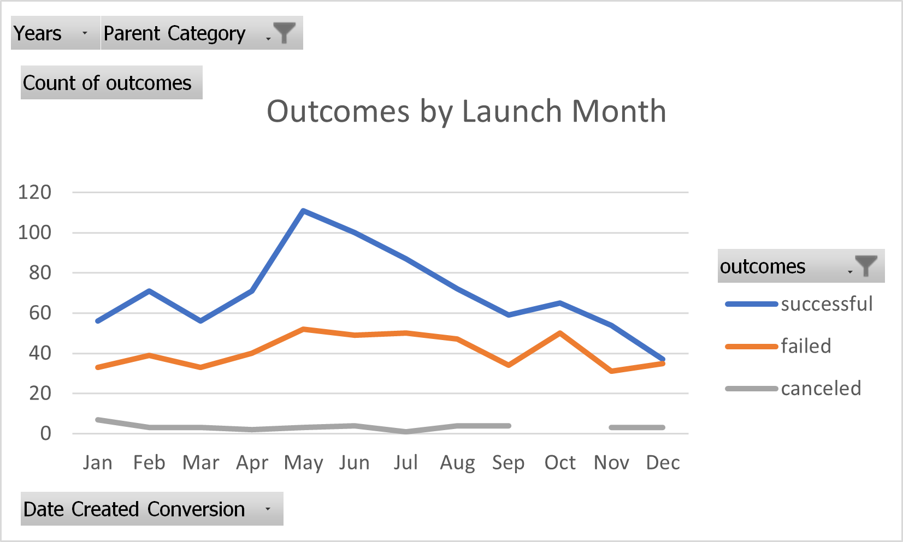
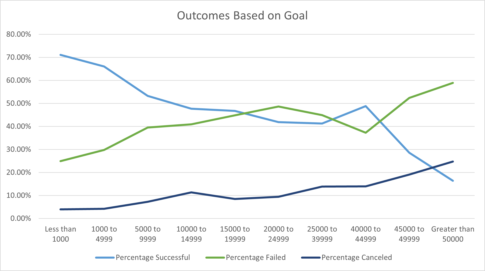
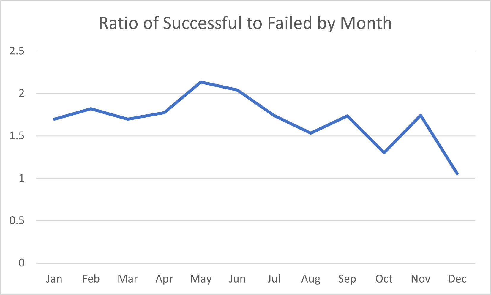

# Kickstarting with Excel

## **Overview of Project**

### **Purpose**
_The purpose of this project is to give Louise some statistical insight into how successful or unsuccesful theater campaigns are based on their pledge goals and the timing of their launch.  This analysis will aid Louise in making an informed decision on the pledge goal and launch date of her campaign._

## **Analysis and Challenges**

### **Analysis of Outcomes Based on Launch Date:**

In this section, we analyze the success rates of campaigns based on their launch month.  As we can see from the following table, theater productions tend to be more successful during the summer months, with the height of success being those campaigns launched in May.

### **Analysis of Outcomes Based on Goals:**

In this section, we analyze the success rates of campaigns based on their pledge goals.  As one might expect, the campaigns launched with the smallest pledge goals tend to be the most successful.  

### **Challenges and Difficulties Encountered:**

If you refer to the "Outcomes by Launch Month" graph, one might notice that the ratio of successful campaigns to failed campaigns does not vary wildly over the months as the raw numbers of successful and failed campaigns do.  Despite the raw number of successful campaigns being the highest in may, the ratio of successful to unsuccessful campaigns is not terribly different in May compared to other months.  Despite this fact, the ratio of successful campaigns to failed campaigns is still highest in May, as the following graph shows.  Note successful campaigns outnumber failed campaigns by more than two to one in May, and there are a roughly equal number of successful and failed campaigns in December.

## **Results:**

- What are two conclusions you can draw about the Outcomes based on Launch Date?

Looking at the pure statistics, campaigns tend to be most successful in the spring and summer months, with the height of success being reached in May with a roughly two to one chance of producing a successful play.  As the graph "Ratio of Successful to Failed by Month" shows, one has the worst chance of producing a successful play if the play launches in December with a roughly fifty-fifty chance of the play being successful.

- What can you conclude about the Outcomes based on Goals?

As the "Outcomes Based on Goal" graph shows, campaigns have a greater chance of success the smaller their pledge goal is.

- What are some limitations of this dataset?

There are many data categories which could enhance our analysis.  It would be helpful to have additional metrics based on the type of play: drama, romance, comedy, tragedy, period piece, modern, etc.  It would also be helpful if we knew the methods by which each of the plays were marketed such as posters, flyers, billboards, social media exposure, news coverage.  It might also be helpful to know how prestigious the actors/actresses were who participated in the plays.  I think we might find that hiring high profile actors produces a higher amount pledged; however, hiring high profile actors might also increase the pledge goal due to the fact that these actors may request a higher pay than a less-known actor/actress.

- What are some other possible tables and/or graphs that we could create?

It might be insightful to produce graphs of the number of backers and average donations versus the launch month as well as the pledge goals.  Due to spending on holidays, we may find that campaigns tend to have more backers and higher average donations during the time of year in which there are few expensive holidays (the summer months).  It may be difficult for low-income and/or large families to donate when they need to spend large amounts of money on holidays such as Thanksgiving or Christmas.

If we could obtain data related to tourism in the regions these plays were launched, we might find a correlation with tourism numbers and number of backers by month, as many people might feel more inclined to attend and donate to play productions while on vacation.  For example, I'm sure many people travel to NYC just to attend broadway plays, and tourism is likely much higher during the summer months.  It would be insightful to correlate a tourism numbers by month graph to our "Outcomes by Launch Month" graph.
